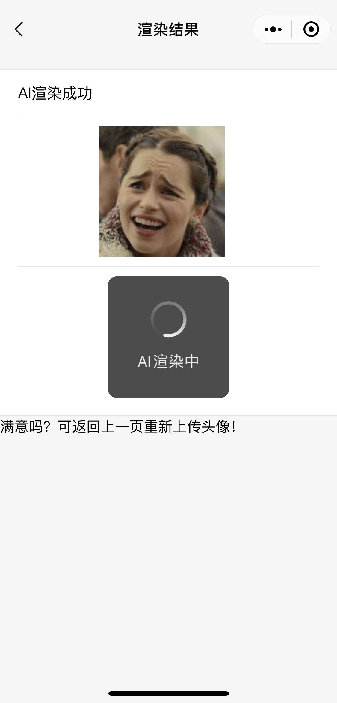

# #2021 TCBC 云开发技术竞赛#-打造你的动漫头像！-大桥队

## 作品简介
**打造你的专属动漫头像！**

封面图

作品类型：
小程序

云开发能力应用情况：
**「云存储」**（临时存储用户上传的图像、生成临时url）、**「云函数」**（读取图像url，返回AI渲染后的图像）

## 功能模块介绍
- 模块一：首页展示效果

- 模块二：上传图像，存入「云存储」中，并生成临时url。代码：`/miniprogram/pages/index/index.js：wx.cloud.uploadFile()`

-  模块三：图像提交「云函数」渲染。代码：`/cloudfunctions/imagetransform/index.js: imagetransform.getImageTransform()`

-  模块四：渲染后图像展示

-  模块五：用户下载图像

## 体验二维码

> 源码链接
https://github.com/georgethrax/a-miniprogram
